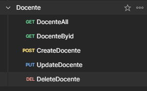
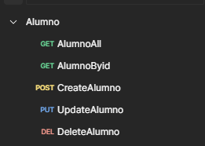
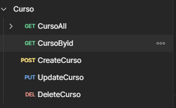
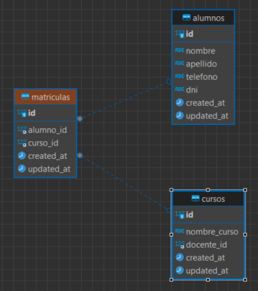
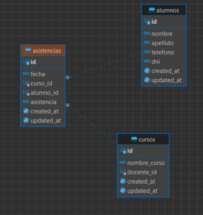
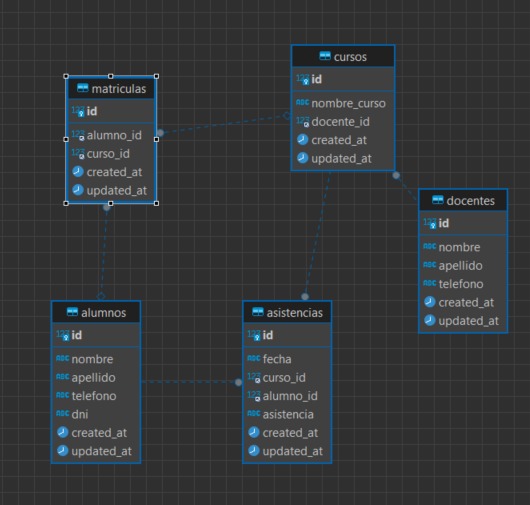

## Mi Mini Proyecto

Mi miniproyecto consiste en crear un programa q me permite hacer las api rest siguiendo el modelo MVC con PDO con la logica de negocios de un Colegio.
donde podre desorrollar:

### Los cruds / pruebas para importar a postman

#### Docentes

[Collecion de postman-Docentes](resources/collectionPostman/Docente.postman_collection.json) 

#### Alumnos

[Collecion de postman-alumnos](resources/collectionPostman/Alumno.postman_collection.json) 

#### Cursos

[Collecion de postman-cursos](resources/collectionPostman/Curso.postman_collection.json) 

###  Matriculas

Asignar un Alumno con diversos Cursos:

###  Asistencias 

Registrar las asistencias del alumno y calificando de acuerdo a sus tardansas:

###  Base de Datos en general con sus relaciones

